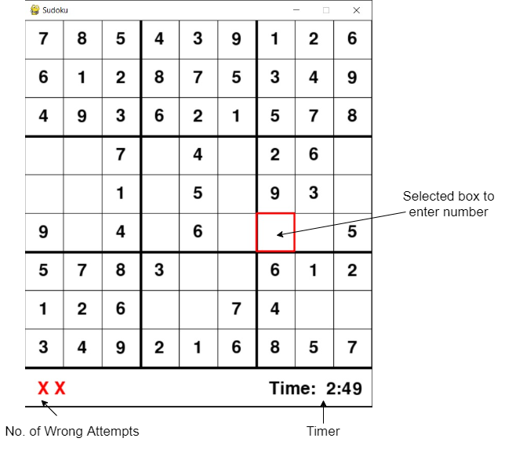
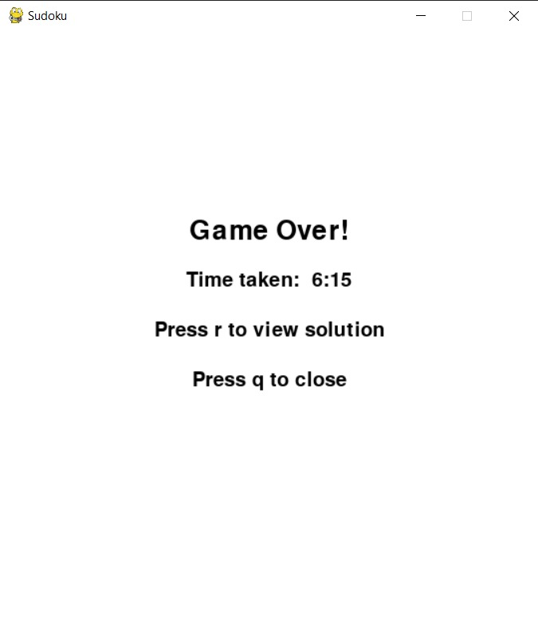
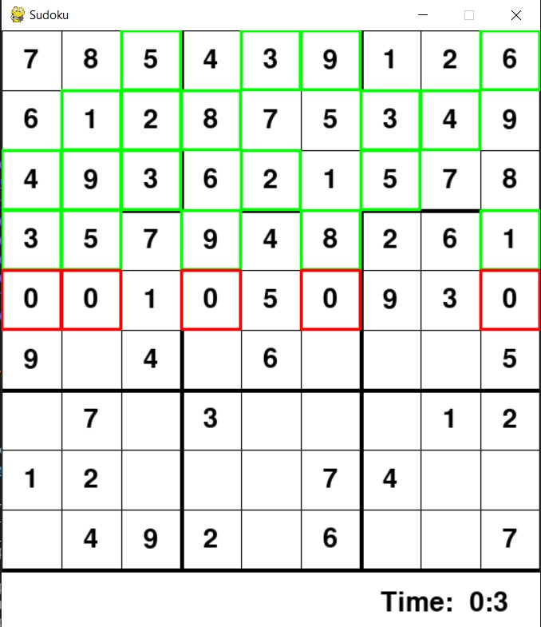

# Sudoku GUI Solver

## About

The script solves any solvable Sudoku Puzzle using <b>Backtracking Algorithm</b>. To visualize this algorithm better and to let the user play the game, an user interface is made using <b>Pygame</b> library in Python.

## Instructions

- Select a box and type in any number (1-9)
- Press enter to confirm
- To completely solve the board, hit spacebar and watch the backtracking algorithm solving the puzzle.

## Screenshots

- Playing Screen
    
  
   

- Game Over
    
  
   

- Backtracking algorithm in action
    
  
